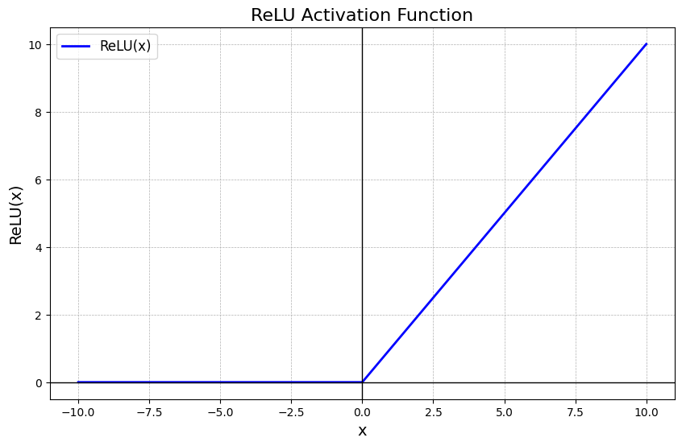

# Neural Network for Image Recognition
In this network, I use MNIST — a dataset of handwritten digits, where each image has a size of 28x28 pixels. \
Example images from this dataset:

## Standard Network
The standard structure of the network is a three-layer neural network consisting of: an input layer, one hidden layer, and an output layer. \
Network structure diagram:\
 
Explanation of the diagram:
- The number of neurons in the input layer is 784, which equals the total number of pixels in a single image (the image size is 28x28).
- The number of neurons in the hidden layer is arbitrary and is set by the user
- The number of neurons in the output layer equals the number of classes, i.e., the number of digits the neural network attempts to recognize (from 0 to 9).
### Activation Functions
#### RelU
The activation function used in the hidden layer is ReLU (Rectified Linear Unit). Mathematically, it is described as: f(x) = max(0, x), and graphically, it looks like this:
 
As seen from the graph, the function returns `X` if `X > 0` and returns 0 if `X < 0` (X is the input value going into the neuron).

ReLU is a very popular activation function due to its computational simplicity (compared to the sigmoid or hyperbolic tangent functions) and because it does not suffer from the vanishing gradient problem as much as the sigmoid and hyperbolic tangent. However, it has the "dying neurons" problem, where a large percentage of neurons stop learning because they always output 0.

#### Softmax
The activation function used in the output layer of the neural network is Softmax.
The softmax function, often used in the final layer of a neural network model for classification tasks, transforms raw output values—also known as logits—into probabilities by taking the exponent of each output value and normalizing these values by dividing by the sum of all exponentials. This process ensures that the output values are in the range (0,1) and sum to 1, making them interpretable as probabilities. \
Formula and example of the function:\
.webp)\
In the example of the created neural network, this function works as follows:
- The final layer may produce a vector of 10 numbers, each corresponding to a digit. However, these numbers do not directly represent probabilities. The softmax function transforms this vector into a probability distribution for each digit (class).
- As a result, its outputs can be directly used for decision-making — the highest value corresponds to the most probable class.
- In classification tasks, **cross-entropy loss** is used to evaluate the model, which works well with Softmax.

### Model Evaluation
To evaluate the model, the cross-entropy loss function is used — a mechanism for quantitatively assessing how well the model's predictions match actual results, rewarding the model for assigning higher probabilities to correct answers. Since it uses a logarithmic function, cross-entropy loss is more sensitive to changes in predictions with high confidence.

This indirectly encourages the model to be more cautious in cases of uncertainty rather than making confident mistakes.

Mathematically, the cross-entropy loss function is written as follows:\
\, where
- `K` is the number of classes.
- `y_k` is the true probability of class k, usually represented as 1 for the correct class and 0 for all other classes.
- `p_k` is the predicted probability of class k.

In practice, it works as follows:
- If the model is confident and assigns a probability close to 1 for the correct class (`p_k` ≈ 1), then `log(p_k)` will be close to 0, and the loss will be small.
- If the model is uncertain or predicts incorrectly (`p_k` ≈ 0), then `log(p_k)` will be a large negative number, and the loss will increase significantly. Thus, the function "penalizes" the model if it assigns a low probability to the correct class.

### Example of Standard Network Performance

Network configuration:\
\
Output:\

## Network with an Additional Layer
After creating the first version of the neural network, I decided to experiment with it and add an additional hidden layer.

Diagram of the neural network structure with an additional layer:\
,  
where the variables `hidden_layer 1` and `hidden_layer 2` denote the number of neurons in the respective hidden layers. These variables are set by the user.

ReLU is used as the activation function in both hidden layers. The use of other functions remained unchanged.

### Performance Results
After adding the new hidden layer, the network started performing significantly worse than its previous version. Upon investigating the cause of this issue, I realized that the problem was the **lack of weight normalization**, meaning that weights were initialized with random values, but without proper initialization, gradients could become **too large or too small**.\
Following this discovery, I decided to implement He initialization for weights.

Mathematical formulation of He initialization:\
\
After adding this initialization, the network started showing significantly better results.
### Example of Performance with an Additional Layer
Network configuration:\
\
Output:\

